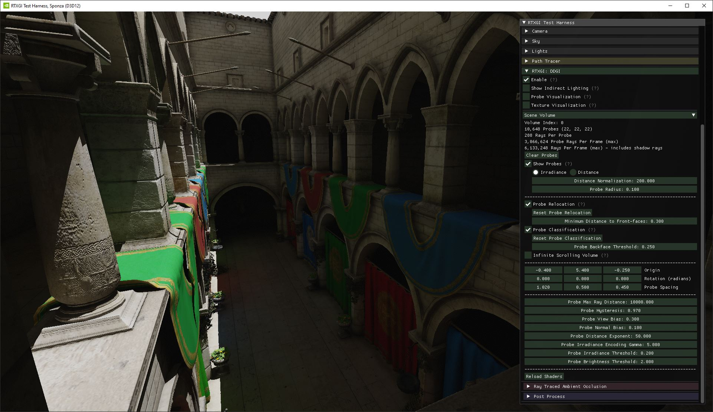

# RTX Global Illumination

Version 1.3

[Change Log](ChangeLog.md)

## Introduction

**RTX G**lobal **I**llumination (RTXGI) is a collection of algorithms that leverage GPU ray tracing to provide scalable solutions for rendering real-time Global Illumination (GI). The goal of RTXGI is to provide optimized implementations of global lighting algorithms that are flexible enough to be useful in both real-time and pre-computed lighting scenarios. Focusing on scalability allows RTXGI to be an effective tool across a wide range of platforms with varying computational capabilities.

Algorithm implementations provided here require graphics APIs and platforms with support for GPU ray tracing (e.g. Microsoft DirectX Raytracing or Vulkan Ray Tracing). That said, it is possible to use RTXGI's Dynamic Diffuse Global Illumination algorithm on development machines with GPU ray tracing support, store the lighting data, and then load the (static) lighting data at run-time on platforms without GPU ray tracing support.

For more information on RTXGI, see the [NVIDIA Developer Page](https://developer.nvidia.com/rtxgi).

## Contents

This repository contains the RTXGI SDK, a sample application, the RTXGI Unreal Engine 4 plugin, and associated documentation.

Although we aim for RTXGI to eventually provide a collection of global illumination algorithms, the current SDK provides one algorithm based on *Dynamic Diffuse Global Illumination (DDGI)*, [first described in this academic publication from NVIDIA Research](https://jcgt.org/published/0008/02/01/) along with collaborators at McGill University and the University of Montreal. Since DDGI is based on irradiance probes (the pre-computed variety are already commonly used in games), it is an ideal entry point for developers to bring the benefits of real-time ray tracing to their tools, technology, and applications without substantial performance penalties. Furthermore, the implementation here includes performance improvements and optimization techniques not available elsewhere.

* [rtxgi-sdk](rtxgi-sdk) contains the SDK source code

    * [rtxgi-sdk/include](rtxgi-sdk/include) contains the include files used by host code and some shaders

    * [rtxgi-sdk/src](rtxgi-sdk/src) contains the host source code and useful utilities

    * [rtxgi-sdk/shaders](rtxgi-sdk/shaders) contains the HLSL shader code to be compiled with the provided [DirectX Shader Compiler (DXC)](https://github.com/microsoft/DirectXShaderCompiler)

* [samples](samples) contains the Test Harness sample application that demonstrates and exercises the SDK's functionality

* [thirdparty](thirdparty) contains third-party software used by the sample application(s)

* **d3d** contains a compatible recent version of the DirectX 12 Agility SDK to use when running on Windows (delivered by Packman)

* **dxc** contains a compatible recent version of the DirectX Shader Compiler for your platform (delivered by Packman)

* [ue4-plugin](ue4-plugin) contains the RTXGI Unreal Engine 4 plugin source code and documentation

* [docs](docs) contains helpful guides and documentation

## System Requirements

The RTXGI SDK and sample application(s) require the following hardware and software:

### Hardware
* Any DXR capable GPU. NVIDIA DXR enabled GPUs are:
    * RTX 4090, 4080
    * RTX 3090 Ti, 3090, 3080 Ti, 3080, 3070 Ti, 3070, 3060 Ti, 3060, 3050
    * Titan RTX
    * RTX 2080 Ti, 2080 SUPER, 2080, 2070 SUPER, 2070, 2060 SUPER, 2060
    * GTX 1660 Ti, 1660 SUPER, 1660
    * Titan Xp
    * GTX 1080 Ti, 1080, 1070 Ti, 1070, 1060 Ti, 1060 6GB (or higher)

### Software (Windows)
* Windows 10 v1809 or higher
* Windows 10 SDK version 10.0.17763 or higher
* [Vulkan SDK 1.2.170]((https://vulkan.lunarg.com/sdk/home)) or higher
* [CMake 3.10](https://cmake.org/download) or higher
* [Visual Studio 2017, 2019, 2022](https://visualstudio.microsoft.com/downloads/) or [Visual Studio Code](https://code.visualstudio.com/download)
* Latest GPU drivers. NVIDIA drivers are [available here.](http://www.nvidia.com/drivers)

### Software (Linux)
* [Vulkan SDK 1.2.170]((https://vulkan.lunarg.com/sdk/home)) or higher
* [CMake 3.10](https://cmake.org/download) or higher
* [Visual Studio Code](https://code.visualstudio.com/download)
* Latest GPU drivers. NVIDIA drivers are [available here.](http://www.nvidia.com/drivers)

## Getting Started

* [Quick Start](docs/QuickStart.md)
* [Algorithms](docs/Algorithms.md)
* [Math Guide](docs/Math.md)
* [Integration Guide](docs/Integration.md)
* [DDGIVolume Reference](docs/DDGIVolume.md)
* [Shader API](docs/ShaderAPI.md)

## Unreal Engine 4

See the [Unreal Engine Plugin](ue4-plugin/4.27/RTXGI/README.md)
