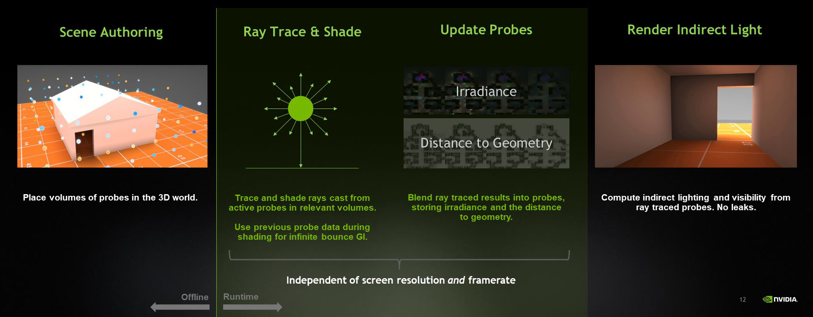

# RTXGI Algorithms

## Dynamic Diffuse Global Illumination (DDGI)

*Dynamic Diffuse Global Illumination (DDGI)* is a global lighting algorithm that extends pre-computed irradiance probes approaches. Lighting techniques built on pre-computed irradiance probes are commonly used today in real-time rendering (see popular commercial products and engines such as Enlighten, Unity, and Unreal Engine); however, these probe-based solutions are not able to resolve visibility and occlusion of dynamic scene elements at runtime. This causes obvious light and shadow "leaking" artifacts.

DDGI resolves the leaking problems by using GPU ray tracing, a fast probe update scheme to maintain per-probe irradiance *and* distance data, and a statistics based occlusion test.

To learn more about DDGI, see these resources:

- [Scaling Probe-Based Real-Time Dynamic Global Illumination for Production (JCGT Paper)](https://jcgt.org/published/0010/02/01/)
- [Dynamic Diffuse Global Illumination with Ray-Traced Irradiance Fields (JCGT Paper)](https://jcgt.org/published/0008/02/01/)
- [Ray-Traced Irradiance Fields (Presented by NVIDIA) - GDC 2019 Talk](https://www.gdcvault.com/play/1026182/)

### Benefits

- Fully dynamic diffuse global illumination in real-time.
- Color transfer.
- Indirect occlusion.
- Support for surfaces and media typically not included in GBuffers (e.g. transluent surfaces and volumetrics).
- Improved workflow for artists (less probe tweaking), compared to traditional irradiance probes.
- No lightmap UVs. No waiting for lightmap bakes.
- In-editor results in real time.
- Scalable performance.
- Probes can be easily pre-computed and loaded for platforms that do not support GPU ray tracing, creating a single lighting path for all platforms.

### Limitations

- Low frequency global illumination signal. High frequency radiometric and geometric details are not reproduced.
- Irradiance temporally accumulates in probes, so there is an unavoidable minimum latency when lighting changes occur.
- Probe data storage can become memory intensive in large environments.

### Additional Notes

Similar to traditional irradiance probes, DDGI does not solve the complete global illumination problem, and **it is best used for the diffuse irradiance component of the full lighting equation**. As a result of the underlying probe based data structure, the computed diffuse irradiance is inherently low frequency and can not capture fine high frequency details. For this reason, DDGI combines effectively with complimentary rendering techniques such as Ray Traced Ambient Occlusion (RTAO). To demonstrate this, RTAO is implemented and combined with DDGI in the Test Harness sample application.

