# RTXGI DDGIVolume Reference

The implementation of the DDGI algorithm revolves around a defined volume of space that supports irradiance queries at arbitrary world-space locations. We refer to this space as a ```DDGIVolume```. The ```DDGIVolume``` can be used in a variety of ways, from placing stationary volumes in fixed positions in a world to attaching a ```DDGIVolume``` to a camera (or player) while scrolling the volume's internal probe grid when movement occurs (see [Volume Movement](#volume-movement) for more on this).

Regardless of use case, the ```DDGIVolume``` executes a set of GPU workloads that implement important parts of the DDGI algorithm. The image below illustrates these steps with the GPU timeline scrubber view from [NVIDIA Nsight Graphics](https://developer.nvidia.com/nsight-graphics).

<figure>
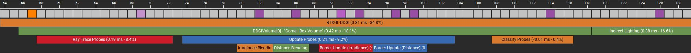</img>
<figcaption><b>Figure 1: The DDGI algorithm (green) in the Nsight Graphics GPU Timeline Scrubber View</b></figcaption>
</figure>

As discussed in the [Integration Guide](Integration.md#integration-steps), the application is responsible for [tracing rays for ```DDGIVolume``` probes](Integration.md#tracing-probe-rays-for-a-ddgivolume) and [gathering indirect light in screen-space](Integration.md#querying-irradiance-with-a-ddgivolume) using the relevant ```DDGIVolumes``` in the scene. The ```DDGIVolume``` handles probe irradiance and distance blending, octahedral texture border updates, probe relocation, and probe classification.

The following sections cover how to use the ```DDGIVolume``` and detail how its functionality is implemented.

# Creating a DDGIVolume

**Step 1:** to create a new ```DDGIVolume```, start by filling out a ```rtxgi::DDGIVolumeDesc``` structure.

- All properties of the descriptor struct are explained in [DDGIVolume.h](../rtxgi-sdk/include/rtxgi/ddgi/DDGIVolume.h#L78).
- Example usage is shown in ```GetDDGIVolumeDesc()``` of [DDGI_D3D12.cpp](../samples/test-harness/src/graphics/DDGI_D3D12.cpp#L371) and [DDGI_VK.cpp](../samples/test-harness/src/graphics/DDGI_VK.cpp#L477).

**Probe Irradiance Gamma**

To improve the light-to-dark convergence and the efficiency of texture storage, we use exponential weighting when storing irradiance. The default gamma exponent is 5.f, but it can be modified by changing ```DDGIVolumeDesc::probeIrradianceEncodingGamma```.

This exponent moves the stored irradiance value into a non-linear space that more closely matches human perception, while also allowing for a smaller texture format. If ```probeIrradianceEncodingGamma``` is set to 1.f, then the stored value remains in linear space and the quality of the lighting will decrease. To account for this quality loss when in linear space, ```DDGIVolumeDesc::probeIrradianceFormat``` can be set to ```RTXGI_DDGI_VOLUME_TEXTURE_FORMAT_F32x4``` to use a larger texture format.


## Describing Resources

Next, specify information about the resources used by the volume (e.g. textures, shader bytecode/pipeline state objects, descriptors, etc.). This step is more involved since resources are API-specific. That said, there are not major differences in the process between D3D12 and Vulkan.

**Step 2:** fill out the appropriate ```rtxgi::d3d12::DDGIVolumeResources``` or ```rtxgi::vulkan::DDGIVolumeResources``` struct for the graphics API you are using (shown below).

**D3D12**

```C++
struct DDGIVolumeResources
{
    DDGIVolumeDescriptorHeapDesc descriptorHeap;
    DDGIVolumeBindlessResourcesDesc bindless;

    DDGIVolumeManagedResourcesDesc managed;
    DDGIVolumeUnmanagedResourcesDesc unmanaged;

    ID3D12Resource* constantsBuffer;
    ID3D12Resource* constantsBufferUpload;
    UINT64 constantsBufferSizeInBytes;
};
```

**Vulkan**

```C++
struct DDGIVolumeResources
{
    DDGIVolumeBindlessResourcesDesc bindless;

    DDGIVolumeManagedResourcesDesc managed;
    DDGIVolumeUnmanagedResourcesDesc unmanaged;

    VkBuffer constantsBuffer;
    VkBuffer constantsBufferUpload;
    VkDeviceMemory constantsBufferUploadMemory;
    uint64_t constantsBufferSizeInBytes;
};
```

The ```DDGIVolumeResources``` structs for D3D12 and Vulkan differ in how memory and descriptors are handled (e.g. D3D12's descriptor heap and Vulkan's ```VkDeviceMemory``` object), which reflects the differences in the APIs themselves.

### Resource Management

**Step 2a:** the first decision to make as you begin to specify resources with a ```DDGIVolumeResources``` struct is *whether the application or the SDK* will own and manage the lifetime of resources.

The SDK provides two modes for these scenarios:

- **Managed Mode**: the SDK allocates and owns volume resources.
  - Use this mode if you don't need explicit control of the resources and want a simpler setup process.
- **Unmanaged Mode**: the application allocates and owns volume resources.
  - Use this mode if you want to allocate, track, and own volume resources explicitly yourself.

**Step 2b:** the ```DDGIVolumeResources``` structs include the ```DDGIVolumeManagedResourcesDesc``` and ```DDGIVolumeUnmanagedResourcesDesc``` structs to describe the resources associated with their respective modes. Fill out the appropriate descriptor struct for the resource mode you want to use. Be sure to set the ```enabled``` field of that struct to ```true```.

- For a complete view of these resource descriptor structs, see [DDGIVolume_D3D12.h](../rtxgi-sdk/include/rtxgi/ddgi/gfx/DDGIVolume_D3D12.h#L138) and [DDGIVolume_VK.h](../rtxgi-sdk/include/rtxgi/ddgi/gfx/DDGIVolume_VK.h#L148).

**Managed Mode**
  - Provide a pointer to the graphics device (```ID3D12Device```/```VkDevice```).
    - (Vulkan only) Provide a handle to the ``VkPhysicalDevice`` and a ```VkDescriptorPool``` too.
  - Provide ```ShaderBytecode``` objects that contain the compiled DXIL shader bytecode for the SDK's DDGI shaders.
    - See [Preparing Shaders](#preparing-shaders) for more information on required shaders and compilation.

**Unmanaged Mode**
  - Create the volume's texture array resources.
    - See [Texture Layout](#texture-layout) for more information.
  - **D3D12**
    - Add descriptor heap entries for the volume's texture array resources.
    - Create render target views for the probe irradiance and distance texture arrays.
    - Create a root signature (if not using bindless resources) with ```GetDDGIVolumeRootSignatureDesc()```.
    - Create a pipeline state object for each shader.
      - See [Preparing Shaders](#preparing-shaders) for more information on required shaders and compilation.
    - Provide pointers for the API-specific resources above using the ```DDGIVolumeManagedResourcesDesc``` struct
  - **Vulkan**
    - Create a pipeline layout and descriptor set (if not using bindless resources) with ```GetDDGIVolumeLayoutDescs()```.
    - Create texture memory and views for each of the volume's texture arrays.
    - Create a shader module and pipeline for each shader.
      - See [Preparing Shaders](#preparing-shaders) for more information on required shaders and compilation.
    - Provide pointers for the API-specific resources above using the ```DDGIVolumeUnmanagedResourcesDesc``` struct

Example use of both Managed and Unmanaged modes is shown in ```GetDDGIVolumeResources()``` of [DDGI_D3D12.cpp](../samples/test-harness/src/graphics/DDGI_D3D12.cpp#L371) and [DDGI_VK.cpp](../samples/test-harness/src/graphics/DDGI_VK.cpp#L520).

  - In the Test Harness sample application, managed vs. unmanaged code paths are separated using the ```RTXGI_DDGI_RESOURCE_MANAGEMENT``` preprocessor define.

### Constants

Regardless of the selected resource management mode, the application is responsible for managing device and upload resources for ```DDGIVolume``` constant data. Constant data for *all volumes* in a scene are expected to be maintained in a structured buffer that is sized for double (or arbitrary) buffering.

- See ```CreateDDGIVolumeConstantsBuffer(...)``` in [DDGI_D3D12.cpp](../samples/test-harness/src/graphics/DDGI_D3D12.cpp#L605) and [DDGI_VK.cpp](../samples/test-harness/src/graphics/DDGI_VK.cpp#L698) for an example of resource creation for constants data.

- ```DDGIVolumeResources::constantsBufferSizeInBytes``` specifies the size (in bytes) of constants data for all volumes in a scene. This value is **not** multiplied by the number of frames being buffered (e.g. 2 or 3) - it is the size (in bytes) of constants for all volumes *for a single frame*.

- ```rtxgi::[d3d12|vulkan]::UploadDDGIVolumeConstants(...)``` is an SDK helper function that transfers constants data for one or more volumes from the CPU to GPU for you.

### Resource Indices

Similar to volume constants, when using bindless resources the application is responsible for managing device and upload resources for ```DDGIVolume``` resource index constant data. **If you are not using bindless resources, skip this section**.

Resource indices specify the location of a resource in a typed resource array (D3D12 and Vulkan) or the location of a resource on the D3D12 Descriptor or Sampler Heaps (Shader Model 6.6 and higher only). Resource indices are specified using the ```DDGIVolumeResourceIndices``` struct, shown below.

```C++
struct DDGIVolumeResourceIndices
{
    uint rayDataUAVIndex;
    uint rayDataSRVIndex;
    uint probeIrradianceUAVIndex;
    uint probeIrradianceSRVIndex;
    uint probeDistanceUAVIndex;
    uint probeDistanceSRVIndex;
    uint probeDataUAVIndex;
    uint probeDataSRVIndex;
    uint probeVariabilityUAVIndex;
    uint probeVariabilitySRVIndex;
    uint probeVariabilityAverageUAVIndex;
    uint probeVariabilityAverageSRVIndex;
};
```

The ```DDGIVolumeResourceIndices``` struct is part of the ```DDGIVolumeBindlessResourcesDesc```, where you can specify the size and location of the CPU and GPU resources that hold the resource index data.

**D3D12**

When using D3D12, it is necessary to specify the bindless implementation type of since there are multiple options (```EBindlessType::RESOURCE_ARRAYS``` or ```EBindlessType::DESCRIPTOR_HEAP```)). When using the Descriptor Heap implementation type, resource indices should be specified using the ```DDGIVolumeDescriptorHeapDesc``` struct instead. See [D3D12 Descriptor and Sampler Heaps](#d3d12-descriptor-and-sampler-heaps) for more information.

```C++
struct DDGIVolumeBindlessResourcesDesc
{
    bool enabled;
    EBindlessType type;

    DDGIVolumeResourceIndices resourceIndices;

    ID3D12Resource* resourceIndicesBuffer;
    ID3D12Resource* resourceIndicesBufferUpload;
    UINT64 resourceIndicesBufferSizeInBytes;
};
```

**Vulkan**

When using Vulkan, it is necessary to specify the byte offset in the push constants block where ```DDGIRootConstants``` are stored. This offset is not relevant when using bound resources since the SDK uses its own pipeline layout and descriptor set configuration.

```C++
struct DDGIVolumeBindlessResourcesDesc
{
    bool enabled;
    uint32_t pushConstantsOffset;

    DDGIVolumeResourceIndices resourceIndices;

    VkBuffer resourceIndicesBuffer;
    VkBuffer resourceIndicesBufferUpload;
    VkDeviceMemory resourceIndicesBufferUploadMemory;
    uint64_t resourceIndicesBufferSizeInBytes;
};
```

As with volume constants, resource index data for *all volumes* in a scene are expected to be maintained in a structured buffer that is sized for double (or arbitrary) buffering.

- See ```CreateDDGIVolumeResourceIndicesBuffer(...)``` in [DDGI_D3D12.cpp](../samples/test-harness/src/graphics/DDGI_D3D12.cpp#L568) and [DDGI_VK.cpp](../samples/test-harness/src/graphics/DDGI_VK.cpp#L669) for an example of resource creation for resource indices data.

- ```DDGIVolumeBindlessResourcesDesc::resourceIndicesBufferSizeInBytes``` specifies the size (in bytes) of resource indices data for all volumes in a scene. This value is **not** multiplied by the number of frames being buffered (e.g. 2 or 3) - it is the size (in bytes) for resource indices across all volumes *for a single frame*.

- ```rtxgi::[d3d|vulkan]::UploadDDGIVolumeResourceIndices(...)``` is an SDK helper function that transfers constants data for one or more volumes from the CPU to GPU for you.

### D3D12 Descriptor and Sampler Heaps

The application is responsible for allocating, managing, and providing information about the descriptor and sampler heaps to the ```DDGIVolume```. For best performance, ```DDGIVolume```s use existing descriptor heaps provided by the application instead of creating their own.

Specify the descriptor and sampler heaps, heap entry size, and location of the constant and resource indices structured buffers on the descriptor heap using the ```DDGIVolumeDescriptorHeapDesc``` struct. 

When using Descriptor Heap bindless (Shader Model 6.6+ only), provide the descriptor heap indices where various volume resources are (or should be) located.

```C++
struct DDGIVolumeDescriptorHeapDesc
{
    ID3D12DescriptorHeap* resources = nullptr; 
    ID3D12DescriptorHeap* samplers = nullptr;

    UINT entrySize;
    UINT constantsIndex;
    UINT resourceIndicesIndex;
    DDGIVolumeResourceIndices resourceIndices;
};
```
The application can query how many descriptor heap slots to reserve for each volume's resources, using the ```rtxgi``` namespace helper functions below:

```C++
int GetDDGIVolumeNumRTVDescriptors();
int GetDDGIVolumeNumTex2DArrayDescriptors();
int GetDDGIVolumeNumResourceDescriptors();
```

## Preparing Shaders

The main workloads executed by a ```DDGIVolume``` are implemented in three shader files:
 * ProbeBlendingCS.hlsl
 * ProbeRelocationCS.hlsl
 * ProbeClassificationCS.hlsl
 * ReductionCS.hlsl

 To make it possible to directly use the SDK's shader files in your codebase (with or without the RTXGI SDK), shader functionality is configured through shader compiler defines. All shaders support both traditionally bound and bindless resource access methods.

### Common Shader Defines

The below defines are required for each shader entry point that is compiled.

```RTXGI_COORDINATE_SYSTEM [0|1|2|3]```

  * Specifies the coordinate system. The options are:
    * ```RTXGI_COORDINATE_SYSTEM_LEFT (0)```
    * ```RTXGI_COORDINATE_SYSTEM_LEFT_Z_UP (1)```
    * ```RTXGI_COORDINATE_SYSTEM_RIGHT (2)```
    * ```RTXGI_COORDINATE_SYSTEM_RIGHT_Z_UP (3)```

```RTXGI_DDGI_RESOURCE_MANAGEMENT [0|1]```
  * Specifies if the application (0: unmanaged) or the SDK (1: managed) own and manage the volume's resources.
  
```RTXGI_DDGI_BINDLESS_RESOURCES [0|1]```
  * Specifies resource access mode (0: bound, 1: bindless).
    * ***Note:** bindless resources are **not** compatible with managed resources mode.*

```RTXGI_BINDLESS_TYPE [0|1]```
  * Specifies the implementation type for bindless resource access. The options are:
    * ```RTXGI_BINDLESS_TYPE_RESOURCE_ARRAYS (0)```
    * ```RTXGI_BINDLESS_TYPE_DESCRIPTOR_HEAP (1)```

```RTXGI_DDGI_SHADER_REFLECTION [0|1]```
  * Specifies if the application uses shader reflection to discover resources declared in shaders.

```RTXGI_DDGI_USE_SHADER_CONFIG_FILE [0|1]```
  * Specifies if a configuration file is used to specify shader defines. This is useful when shader define values are the same across multiples shaders being compiled.

### Resource Defines

When managing resources manually (i.e. using unmanaged resource mode), it is necessary to specify the binding register and space (or binding slot and descriptor set index in Vulkan) of each resource for the SDK shaders to properly look up resources.

This process differs slightly between traditional bound and bindless resource access methods. As a result, different shader defines are expected. The defines for each mode are listed below.

***Note:** when using D3D12 Descriptor Heap bindless resource access, *it is not necessary* to specify binding registers or spaces since resources are retrieved directly from the descriptor heap. Convenient!*

---

***D3D12 Only***

```CONSTS_REGISTER [bX]``` <br> ```CONSTS_SPACE [spaceY]```
  * The shader register ```X``` and space ```Y``` of the DDGI root constants. See [DDGIRootConstants.hlsl](../rtxgi-sdk/shaders/ddgi/include/DDGIRootConstants.hlsl) for more information.

---

***Bindless Resources***

```VOLUME_CONSTS_REGISTER [tX|X]``` <br> ```VOLUME_CONSTS_SPACE [spaceY|Y]```
  * *D3D12:* the SRV shader register ```X``` and space ```Y``` of the DDGIVolume constants structured buffer.
  * *Vulkan:* the binding slot ```X``` and descriptor set index ```Y``` of the DDGIVolume constants structured buffer.

```VOLUME_RESOURCES_REGISTER [tX|X]``` <br> ```VOLUME_RESOURCES_SPACE [spaceY|Y]```
  * *D3D12:* the SRV shader register ```X``` and space ```Y``` of the DDGIVolume resource indices structured buffer.
  * *Vulkan:* the binding slot ```X``` and descriptor set index ```Y``` of the DDGIVolume resource indices structured buffer.

```RWTEX2DARRAY_REGISTER [uX|X]``` <br> ```RWTEX2DARRAY_SPACE [spaceY|Y]```
  * *D3D12:* the UAV shader register ```X``` and space ```Y``` of the bindless RWTexture2DArray resource array.
  * *Vulkan:* the binding slot ```X``` and descriptor set index ```Y``` of the bindless RWTexture2DArray resource array.


***Vulkan Bindless Only***

Unlike D3D12, it is not possible to specify multiple (virtual) blocks of push constants in Vulkan. Instead, all push constants exist in the same memory block and it is necessary for shaders to understand the organization of that memory block to look up values correctly. This makes it more complicated for SDK shaders to index into the application's push constants block.

The following defines provide SDK shaders with the information necessary to understand the application's push constants block. This requires a strong understanding of Vulkan and your application, so things can get hairy quickly. An example is shown in the Test Harness's [DDGI.cpp](../samples/test-harness/src/graphics/DDGI.cpp#L47).

```RTXGI_PUSH_CONSTS_TYPE [0|1|2]```
  * Specifies how an SDK shader references push constants data. The options are:
    * ```NONE (0)```
      * The shader doesn't use push constants
    * ```RTXGI_PUSH_CONSTS_TYPE_SDK (1)```
      * The shader uses the SDK's push constants layout
    * ```RTXGI_PUSH_CONSTS_TYPE_APPLICATION (2)```
      * The shader uses the application's push constants layout

```RTXGI_DECLARE_PUSH_CONSTS [0|1]```
  * Specifies whether ```DDGIRootConstants.hlsl``` should declare the push constants struct. Useful when the push constants struct is not already declared elsewhere.

```RTXGI_PUSH_CONSTS_STRUCT_NAME```
  * Specifies the struct (type) name of the application's push constants struct

```RTXGI_PUSH_CONSTS_VARIABLE_NAME```
  * Specifies the variable name of the application's push constants

```RTXGI_PUSH_CONSTS_FIELD_DDGI_VOLUME_INDEX_NAME```
  * Specifies the name of the DDGIVolume index field in the application's push constants struct

---

***Bound Resources***

```VOLUME_CONSTS_REGISTER [tX|X]``` <br> ```VOLUME_CONSTS_SPACE [spaceY|Y]```
  * *D3D12:* the SRV shader register ```X``` and space ```Y``` of the DDGIVolume constants structured buffer.
  * *Vulkan:* the binding slot ```X``` and descriptor set index ```Y``` of the DDGIVolume constants structured buffer.

```RAY_DATA_REGISTER [uX|X]``` <br> ```RAY_DATA_SPACE [spaceY|Y]```
  * *D3D12:* the UAV shader register ```X``` and space ```Y``` of the DDGIVolume ray data texture array.
  * *Vulkan:* the binding slot ```X``` and descriptor set index ```Y```of the DDGIVolume ray data texture array.

```OUTPUT_REGISTER [uX|X]``` <br> ```OUTPUT_SPACE [spaceY|Y]```
  * *D3D12:* the UAV shader register ```X``` and space ```Y``` of the DDGIVolume irradiance or distance texture array.
  * *Vulkan:* the binding slot ```X``` and descriptor set index ```Y``` of the DDGIVolume irradiance or distance texture array.

```PROBE_DATA_REGISTER [uX|X]``` <br> ```PROBE_DATA_SPACE [spaceY|Y]```
  * *D3D12:* the UAV shader register ```X``` and space ```Y``` of the DDGIVolume probe data texture array.
  * *Vulkan:* the binding slot ```X``` and descriptor set index ```Y``` of the DDGIVolume probe data texture array.

```PROBE_VARIABILITY_REGISTER [uX|X]``` <br> ```PROBE_VARIABILITY_SPACE [spaceY|Y]```
  * *D3D12:* the UAV shader register ```X``` and space ```Y``` of the DDGIVolume probe variability texture array.
  * *Vulkan:* the binding slot ```X``` and descriptor set index ```Y``` of the DDGIVolume probe variability texture array.

---

### [```ProbeBlendingCS.hlsl```](../rtxgi-sdk/shaders/ddgi/ProbeBlendingCS.hlsl)

This file contains compute shader code that updates (i.e. blends) either radiance or distance values in a texture array of probes stored with an octahedral parameterization. Irradiance and distance texels for *all probes of a volume* are processed in parallel, across two overlapping dispatch calls (i.e. without serializing barriers). During this process, radiance and ray hit distance data are read from the volume's Probe Ray Data texture array.

This shader is used by the SDK's ```rtxgi::[d3d12|vulkan]::UpdateDDGIVolumeProbes(...)``` function.

**Compilation Instructions**

Compile **two** versions of this shader: one for 1) radiance blending and another for 2) distance blending. See the Configuration Defines (below) to specify the blending mode before compilation. After successful shader compilation, set the compiled DXIL bytecode (or pipelines/shader modules) on the appropriate fields of the managed or unmanaged resources struct. See ```CompileDDGIVolumeShaders()``` in [DDGI.cpp](../samples/test-harness/src/graphics/DDGI.cpp#L107) for an example.

  - **Managed Mode:** set the compiled DXIL bytecode of the two blending shaders:
    - ```DDGIVolumeManagedResourcesDesc::probeBlendingIrradianceCS```
    - ```DDGIVolumeManagedResourcesDesc::probeBlendingDistanceCS```
  - **Unmanaged Mode:** create and set the pipeline state objects of the two blending shaders:
    - ```DDGIVolumeUnmanagedResourcesDesc::probeBlendingIrradiance[PSO|Pipeline]```
    - ```DDGIVolumeUnmanagedResourcesDesc::probeBlendingDistance[PSO|Pipeline]```
      - In Vulkan, also create and set shader modules of the two blending shaders:
        - ```DDGIVolumeUnmanagedResourcesDesc::probeBlendingIrradianceModule```
        - ```DDGIVolumeUnmanagedResourcesDesc::probeBlendingDistanceModule```

**Configuration Defines**

```RTXGI_DDGI_PROBE_NUM_TEXELS [n]```
  * Specifies the number of texels ```n``` in one dimension of a probe ***including the 1-texel border***.
    * For example, set this define to 8 for a probe with 8x8 texels.

```RTXGI_DDGI_BLEND_RADIANCE [0|1]```
  * Specifies the probe blending mode (0: distance, 1: radiance).

```RTXGI_DDGI_BLEND_SHARED_MEMORY [0|1]```
  * Toggles using shared memory to cache ray radiance and distance values. Enabling this can substantially improve performance at the cost of higher register and shared memory use (potentially lowering occupancy).

```RTXGI_DDGI_BLEND_RAYS_PER_PROBE [n]```
  * Specifies the number of rays ```n``` traced per probe. *Required when blending shared memory is enabled*.

```RTXGI_DDGI_BLEND_SCROLL_SHARED_MEMORY [0|1]``` 
  * Toggles the use of shared memory to store the result of probe scroll clear tests. When enabled, the scroll clear tests are performed by the group's first thread and written to shared memory for use by the rest of the thread group . This can reduce the compute workload and improve performance on some hardware.

**Debug Defines**

Debug modes are available to help visualize data in the probes. Visualized data is output to the probe irradiance texture array. To use the debug modes, the irradiance texture array format must be set to ```RTXGI_DDGI_VOLUME_TEXTURE_FORMAT_F32x4```.

```RTXGI_DDGI_DEBUG_PROBE_INDEXING [0|1]```
  * Toggles a visualization mode that outputs probe indices as colors.

```RTXGI_DDGI_DEBUG_OCTAHEDRAL_INDEXING [0|1]```
  * Toggles a visualization mode that outputs colors for the directions computed for the octahedral UV coordinates returned by ```DDGIGetNormalizedOctahedralCoordinates()```.


---


### [```ProbeRelocationCS.hlsl```](../rtxgi-sdk/shaders/ddgi/ProbeRelocationCS.hlsl)

This file contains compute shader code that attempts to reposition probes if they are inside of or too close to surrounding geometry. See [Probe Relocation](#probe-relocation) for more information.

This shader is used by the ```rtxgi::[d3d12|vulkan]::RelocateDDGIVolumeProbes(...)``` function.

**Compilation Instructions**

This shader file provides two entry points:
 - ```DDGIProbeRelocationCS()``` - performs probe relocation, moving probes within their grid voxel.
 - ```DDGIProbeRelocationResetCS()``` - resets all probe world-space positions to the center of their grid voxel.

Pass compiled shader bytecode or pipeline state objects to the  `ProbeRelocationBytecode` or `ProbeRelocation[PSO|Pipeline]` structs that correspond to the entry points in the shader file (see below).

```C++
struct ProbeRelocationBytecode
{
    ShaderBytecode updateCS; // DDGIProbeRelocationCS() entry point
    ShaderBytecode resetCS;  // DDGIProbeRelocationResetCS() entry point
};
```


---


### [```ProbeClassificationCS.hlsl```](../rtxgi-sdk/shaders/ddgi/ProbeClassificationCS.hlsl)

This file contains compute shader code that classifies probes into various states for performance optimization. See [Probe Classification](#probe-classification) for more information.

This shader is used by the ```rtxgi::[d3d12|vulkan]::ClassifyDDGIVolumeProbes(...)``` function.

**Compilation Instructions**

Similar to ```ProbeRelocationCS.hlsl```, this shader file provides two entry points:
 - ```DDGIProbeClassificationCS()``` - performs probe classification.
 - ```DDGIProbeClassificationResetCS()``` - resets all probes to the default classification state.

Pass compiled shader bytecode or pipeline state objects to the  `ProbeClassificationBytecode` or `ProbeClassification[PSO|Pipeline]` structs that corresponds to the entry points in the shader file (see below).

```C++
struct ProbeRelocationBytecode
{
    ShaderBytecode updateCS; // DDGIProbeClassificationCS() entry point
    ShaderBytecode resetCS;  // DDGIProbeClassificationResetCS() entry point
};
```

---

### [```ReductionCS.hlsl```](../rtxgi-sdk/shaders/ddgi/ReductionCS.hlsl)

This file contains compute shader code that reduces the probe variability texture down to a single value. See [Probe Variability](#probe-variability) for more information.

This shader is used by the ```rtxgi::[d3d12|vulkan]::CalculateDDGIVolumeVariability(...)``` function.

**Compilation Instructions**

This shader file provides two entry points:
 - ```DDGIReductionCS()``` - performs initial reduction pass on per-probe-texel variability data.
 - ```DDGIExtraReductionCS()``` - if the probe variability texture is too large to reduce down to one value in a single pass, this shader will perform additional reductions and can be run repeatedly until the output reaches a single value.

Pass compiled shader bytecode or pipeline state objects to the  `ProbeVariabilityBytecode` or `ProbeVariability[PSO|Pipeline]` structs that corresponds to the entry points in the shader file (see below).

```C++
struct ProbeVariabilityBytecode
{
    ShaderBytecode reductionCS;      // DDGIReductionCS() entry point
    ShaderBytecode extraReductionCS; // DDGIExtraReductionCS() entry point
};
```

---

## Texture Layout

The ```DDGIVolume``` uses six texture arrays to store its data:

 1. Probe Ray Data
 2. Probe Irradiance
 3. Probe Distance
 4. Probe Data
 5. Probe Variability
 6. Probe Variability Average

### Probe Ray Data

This texture array stores the radiance from and distance to surfaces intersected by rays traced from probes in the volume.

 - The texture array is composed of ```slices``` that correspond to planes of probes oriented perpendicular to the coordinate system's up axis.

<figure>
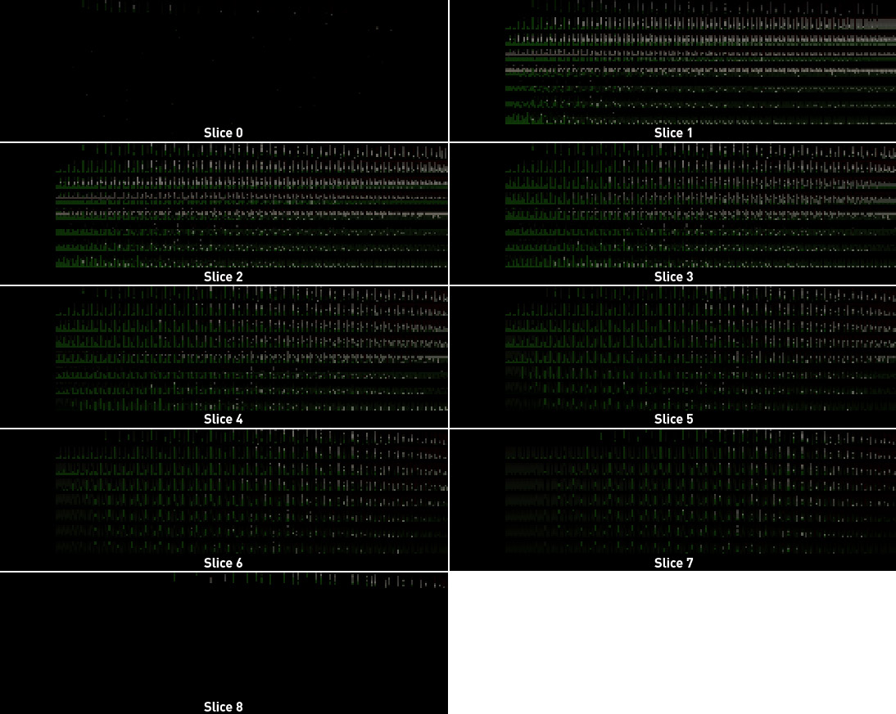</img>
<figcaption><b>Figure 2: The Probe Ray Data texture array (all slices) from the Cornell Box scene</b></figcaption>
</figure>

- A texture array slice ```row``` represents a single probe within the horizontal plane of probes. The row number is the probe's index *within that slice*.
- A texture array slice ```column``` represents rays traced from probes. Column number is the ray's index.
 - Each ```texel``` contains the incoming radiance from and distance to the closest surface obtained by ray ```column#```.

<figure>
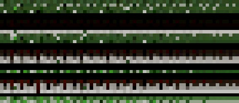</img>
<figcaption><b>Figure 3: The Probe Ray Data texture (zoomed, brightened) from the Cornell Box scene</b></figcaption>
</figure>

### Probe Irradiance and Distance Texture Arrays

Irradiance and distance data for the probes of a volume are stored in two texture arrays (one for irradiance, one for distance). Each probe is stored using an octahedral parameterization of a sphere unwrapped to the unit square as described by [Cigolle et al](http://jcgt.org/published/0003/02/01/).

<figure>
</img>
<figcaption><b>Figure 4: Octahedral parameterization of a sphere <a href="http://jcgt.org/published/0003/02/01/" target="_blank">[Cigolle et al. 2014]</b></a></figcaption>
</figure>

To support hardware bilinear texture sampling of the unwrapped probes, our octahedral textures include a 1-texel border.

***Note:** the ```DDGIVolumeDesc``` struct includes fields to make clear how many texels are part of the probe interior vs. border. For example, see ```DDGIVolumeDesc::probeNumIrradianceTexels``` and ```DDGIVolumeDesc::probeNumIrradianceInteriorTexels```.*

Below are annotated diagrams of the unwrapped octahedral unit square for a single probe. The left and center diagrams highlight the 1-texel border added to a 6x6 texel interior and identify the texels that map to the "front" and "back" hemispheres of the probe. The scheme to populate border texels with the data for bilinear interpolation is shown on the right.

<figure>
</img>
<figcaption><b>Figure 5: Octahedral map interior and border texel layout</b></a></figcaption>
</figure>

Probe octahedral maps for a volume are organized in texture arrays, based on the 3D grid-space coordinates of probes in the ```DDGIVolume```. Just like the Probe Ray Data texture array, each irradiance and distance texture array slice represents a plane of probes oriented perpendicular to the coordinate system's up axis.

***Note:** the ```rtxgi::GetDDGIVolumeTextureDimensions(...)``` function returns the texture array dimensions for a given volume and texture resource type based on the active coordinate system.*

A visualization of irradiance and distance texture array slices is below:

<figure>
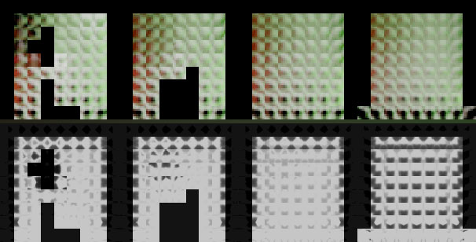</img>
<figcaption><b>Figure 6: Irradiance (top) and distance (bottom) probe atlases for the Cornell Box scene</b></a></figcaption>
</figure>

### Probe Data

This texture array stores world-space offsets and classification states for all probes of a volume. World-space probe offsets are used in [Probe Relocation](#probe-relocation) and probe states are used in [Probe Classification](#probe-classification). As with the other texture array resources, each Probe Data texture array slice represents a plane of probes oriented perpendicular to the coordinate system's up axis. The main difference is that each probe is represented with *one texel*.

Within a texel:
- World-space offsets for probe relocation are stored in the XYZ channels.
  - ```ProbeDataCommon.hlsl``` contains helper functions for reading and writing world-space offset data.
- Probe classification state is stored in the W channel.

 Below is a visualization of the probe data texture's world-space offsets (top) and probe states (bottom).

<figure>
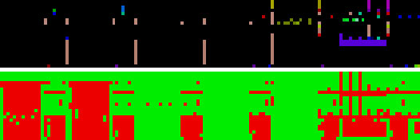</img>
<figcaption><b>Figure 7: A visualization of the Probe Data texture (zoomed) for the Crytek Sponza scene</b></figcaption>
</figure>

### Probe Variability

This texture array stores the [coefficient of variation](https://en.wikipedia.org/wiki/Coefficient_of_variation) for all probe irradiance texels in a volume used by [Probe Variability](#probe-variability). The texture dimensions and layout are the same as the irradiance texture array ***with probe border texels omitted***. This texture array has a single channel that stores the scalar coefficient of variation value.

Below is a visualization of the texture array. The visualization defines a threshold value, then marks inactive probes in blue, below-threshold values in red, and above-threshold values in green.

<figure>
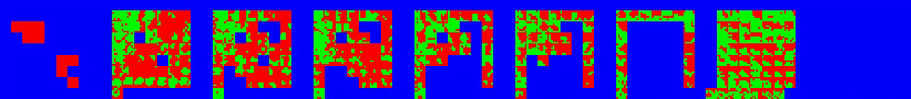</img>
<figcaption><b>Figure 8: A visualization of the Probe Variability texture array for the Cornell Box scene</b></figcaption>
</figure>

### Probe Variability Average

[Probe Variability](#probe-variability) averages the coefficient of variation of all probes in a volume to generate a single variability value. This texture array stores the intermediate values used in the averaging process. The final average variability value is stored in texel (0, 0) when the reduction passes complete.

This texture array has two channels:
  - The averaged coefficient of variation is stored in the R channel
  - A weight the reduction shader uses to average contributions from all probes is stored in the G channel

Below is a visualization of the texture array. The visualization defines a threshold value, then marks inactive probes in blue, below-threshold values in red, and above-threshold values in green.

<figure>
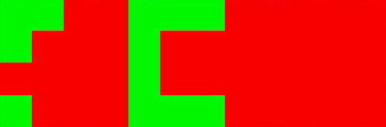</img>
<figcaption><b>Figure 9: A visualization of the Probe Variability Average texture for the Cornell Box scene</b></figcaption>
</figure>

### Probe Count Limits

In addition to the available memory of the physical device, the number of probes a volume can contain is bounded by the graphics API's limits on texture (array) resources.

The relevant limits are the:

1. maximum number of texels allowed *in a single dimension* of a two dimensional texture
   * **D3D12:** 16,384 texels. See ```D3D12_REQ_TEXTURE2D_U_OR_V_DIMENSION``` in [d3d12.h](https://docs.microsoft.com/en-us/windows/win32/direct3d12/constants)
   * **Vulkan:** the specification requires support for *at least* 4,096 texels. Most implementations on [Windows](https://vulkan.gpuinfo.org/displaydevicelimit.php?name=maxImageDimension2D&platform=windows) and [Linux](https://vulkan.gpuinfo.org/displaydevicelimit.php?name=maxImageDimension2D&platform=linux) support 16,384 or even 32,768 texels. Check [vkGetPhysicalDeviceImageFormatProperties()](https://www.khronos.org/registry/vulkan/specs/1.2-extensions/man/html/vkGetPhysicalDeviceImageFormatProperties.html) for the limits of your hardware and platform combination. 16,384 is a safe assumption for hardware that supports D3D12.

2. maximum number of texture array slices (called `layers` in Vulkan)
   * **D3D12:** 2,048 slices. See ```D3D12_REQ_TEXTURE2D_ARRAY_AXIS_DIMENSION``` in [d3d12.h](https://docs.microsoft.com/en-us/windows/win32/direct3d12/constants)
   * **Vulkan**: See [```VkPhysicalDeviceProperties::maxImageArrayLayers```](https://registry.khronos.org/vulkan/specs/1.3-extensions/man/html/VkPhysicalDeviceLimits.html). 2,048 is a safe assumption for devices that support D3D12.

**Maximum Probes Per Plane**

Since the Probe Ray Data texture array stores one probe per row *and* all probes of a horizontal plane in a texture array slice, **API limit #1 determines the maximum number of probes that can be represented in a horizontal plane of probes**.

Using D3D12 limits, the maximum:
* number of probes per horizontal plane is **16,384**
* number of probes per horizontal plane *axis* (e.g. X and Z in a right hand, y-up coordinate system) is:
```C++
    maxProbeCountX = 16,384 / probeCountZ
    maxProbeCountZ = 16,384 / probeCountX
```

***Note:** although less flexible, **128** (i.e. the square root of 16,384) is a simple maximum to enforce per horizontal axis that may be more straight-forward to expose in tools for artists. Otherwise, using the above equations to dynamically display maximums per dimension is recommended.*

**Maximum Planes Per Volume**

With the maximum number of probes per plane known, the maximum number of probes per volume becomes a function of how many planes of probes are permitted. This maps to **API limit #2**.

Using D3D12 limits, the *theoretical* maximum number of probes per volume is:
```C++
maxTheoreticalProbesPerVolume = 16,384 probes/plane * 2,048 planes = 33,554,432 probes
```

This is a *theoretical* maximum since storing this number of probes requires 64 gibibytes of dedicated VRAM (a quantity that no consumer GPU yet contains). Additionally, **graphics APIs also restrict the maximum size (in bytes) of any *single* memory resource**. In D3D12, attempting to create any single resource larger than **four gibibytes** results in the create call failing, an E_OUTOFMEMORY error being returned, and the graphics device being removed. 

When using the default texture format settings and tracing 256 rays per probe, the Probe Ray Data texture array will be the largest resource (in bytes). As a result, **the maximum *practical* number of probe planes (slices) per volume** is:
```C++
maxPlanesPerVolume = 4,294,967,296 bytes / (p probes/plane * r rays/probe * b bytes/ray)
```

For example, consider a volume with 128 probes on both the X and Z axes that traces 256 rays per probe and uses the ```EDDGIVolumeTextureFormat::F32x2``` texture format for the Probe Ray Data texture array:
```C++
maxPlanesPerVolume = 4,294,967,296 bytes / (16,384 probes/plane * 256 rays/probe * 8 bytes/ray)
maxPlanesPerVolume = 4,294,967,296 bytes / (33,554,432 bytes/plane)
maxPlanesPerVolume = 128 planes
```

***Note:** Depending on the number of rays traced per probe and texture format(s) chosen, the Probe Distance texture array may be the largest of the four volume texture resources. In this case, the formula to determine the maximum number of planes per volume will instead be:*
```C++
maxPlanesPerVolume = 4,294,967,296 bytes / (p probes/plane * t texels/probe * b bytes/texel)
```

For example, consider a volume that traces 128 rays per probe and uses ```EDDGIVolumeTextureFormat::F32x2``` for the distance texture array format.
```C++
maxPlanesPerVolume = 4,294,967,296 bytes / (p probes/plane * 16x16 texels/probe * 8 bytes/texel)
```

**Maximum Probes Per Volume**

With the maximum number of probes per horizontal plane *and* the maximum number of planes known, the maximum number of probes per volume is given by multiplying the two values:
```C++
maxProbesPerVolume = maxProbesPerPlane * maxPlanesPerVolume
```

Following the examples above, a volume with 128 probes on all three axes that traces 256 rays/probe and uses the default texture formats can contain a maximum of ~2 million probes.
```C++
maxProbesPerVolume = 16,384 * 128
maxProbesPerVolume = 2,097,152
```


## Create()

**Step 3:** with the ```DDGIVolumeDesc``` and ```DDGIVolumeResources``` structs prepared, the final step to create a new volume is to instantiate a ```DDGIVolume``` instance and call the ```DDGIVolume::Create()``` function. The ```Create()``` function validates the parameters passed via the structs and creates the appropriate resources (if in managed mode).

- ```Create()``` checks for errors and reports them using the ```ERTXGIStatus``` enumeration. See [Common.h](../rtxgi-sdk/include/rtxgi/Common.h) for the complete list of return status codes.

After a successful ```Create()``` call the ```DDGIVolume``` is ready to use!

See [Updating a DDGIVolume](#updating-a-ddgivolume), [Volume Movement](#volume-movement), [Probe Relocation](#probe-relocation), and [Probe Classification](#probe-classification) for more information on use.

# Updating a ```DDGIVolume```

Before tracing rays for a volume, call the ```DDGIVolume::Update()``` function to:
  - Compute a new random rotation to apply to the ray directions generated for each probe with ```DDGIGetProbeRayDirection()```.
  - Compute new probe scroll offsets and probe clear flags (if infinite scrolling movement is enabled).

Well distributed random rotations are computed using [James Arvo’s implementation from Graphics Gems 3 (pg 117-120)](http://citeseerx.ist.psu.edu/viewdoc/download?doi=10.1.1.53.1357&rep=rep1&type=pdf) in the ```DDGIVolume::ComputeRandomRotation()``` function.

If ```Update()``` is not called, the previous rotation is used and the same data as the previous frame is unnecessarily recomputed. A common update frequency is to update the probes with newly ray traced data every frame; however, this is not the only option. Aternatively, updates may be scheduled at a lower frequency than the frame rate, or even as asynchronous workloads that execute continuously on lower priority background queues - essentially streaming radiance and distance data to ```DDGIVolume``` probes. This functionality is not directly implemented by the SDK, but the separation of functionality in the ```DDGIVolume::Update()``` and ```rtxgi::[d3d12|vulkan]::UpdateDDGIVolumeProbes(...)``` functions provides the flexibility for this possibility.


# Volume Movement

The simplest use of a ```DDGIVolume``` is to place it in a fixed location of the world that never changes. There are many scenarios where this basic use case is not sufficient though; for example, when the space requiring global illumination *is itself not stationary*. Examples of this include elevators, trains, cars, spaceships, and many more.

To achieve consistent results in moving spaces:
 - Attach the ```DDGIVolume``` to the moving space's reference frame.
 - Translate the volume using ```DDGIVolume::SetOrigin(...)```.
 - Rotate the volume using ```DDGIVolume::SetEulerAngles(...)```.

```DDGIVolume``` translation and rotation functions are also useful for in-editor debugging purposes, to visualize how various probe configurations function in different locations of a scene.

## Infinite Scrolling Movement

If the scene requiring dynamic global illumination exists in an open or large world setting, it may not be possible (or practical) to cover the entire space with one, or even multiple, ```DDGIVolume``` due to memory and/or performance limits. To address this problem and provide a solution with fixed memory and performance characteristics, the ```DDGIVolume``` includes a mode called *Infinite Scrolling Volume (ISV)*.

When enabled, an infinite scrolling volume provides a virtual infinite volume without requiring an unbounded number of probes (or memory to store them).

This is accomplished by:
  - Computing lighting for a subset of the infinite space. This is called the *active* space.
  - Moving - or *scrolling* - the active space through the infinite volume.

Critically, instead of adjusting the position of all probes when the active area is scrolled, *only the planes of probes on the edges of the volume* on the axis of motion are invalidated and must reconverge. *All interior probes remain stationary* and retain valid irradiance and distance values. This behavior is analagous to how tank tread rolls forward: the tread's individual segments remain in fixed locations while in contact with the ground.

<figure>
</img>
<figcaption><b>Figure 10: Infinite Scrolling Volume Movement</b></figcaption>
</figure>

ISVs are also useful when dynamic indirect lighting is desired around the camera view or a player character. Anchor the infinite scrolling volume to the camera view or a player character and use the camera or player's movement to drive the volume's scrolling of the active area.

To use the ```DDGIVolume``` infinite scrolling feature, set ```DDGIVolumeDesc::movementType``` to ```EDDGIVolumeMovementType::Scrolling``` during initialization or call ```DDGIVolume::SetMovementType(EDDGIVolumeMovementType::Scrolling)```.

To adjust the active area of the ISV (i.e. perform scrolling):
  - Call ```DDGIVolume::SetScrollAnchor(...)```.
  - Provide a world-space position that the volume should scroll its probes towards. The volume will scroll planes of probes and attempt to place the active area's origin as close to the scroll anchor as possible.

**Other Notes:**
  - The amount of probe scrolling can be inspected with ```DDGIVolume::GetScrollOffsets()```.
  - Scroll offsets are reset to zero when probes complete an entire cycle.
    - i.e. when (probeScrollOffsets.x % probeCounts.x) == 0
  - Volumes with infinite scrolling movement ignore rotation transforms.
  - Volumes with infinite scrolling movement can be translated with ```DDGIVolume::SetOrigin(...)``` if the space itself moves too.

# Probe Relocation

Any regular grid of sampling points will struggle to robustly handle all content in all lighting situations. The probe grids employed by DDGI are no exception. To mitigate this shortcoming, the ```DDGIVolume``` provides a "relocation" feature that automatically adjusts the world-space position of probes at runtime to avoid common problematic scenarios (see below).

<figure>
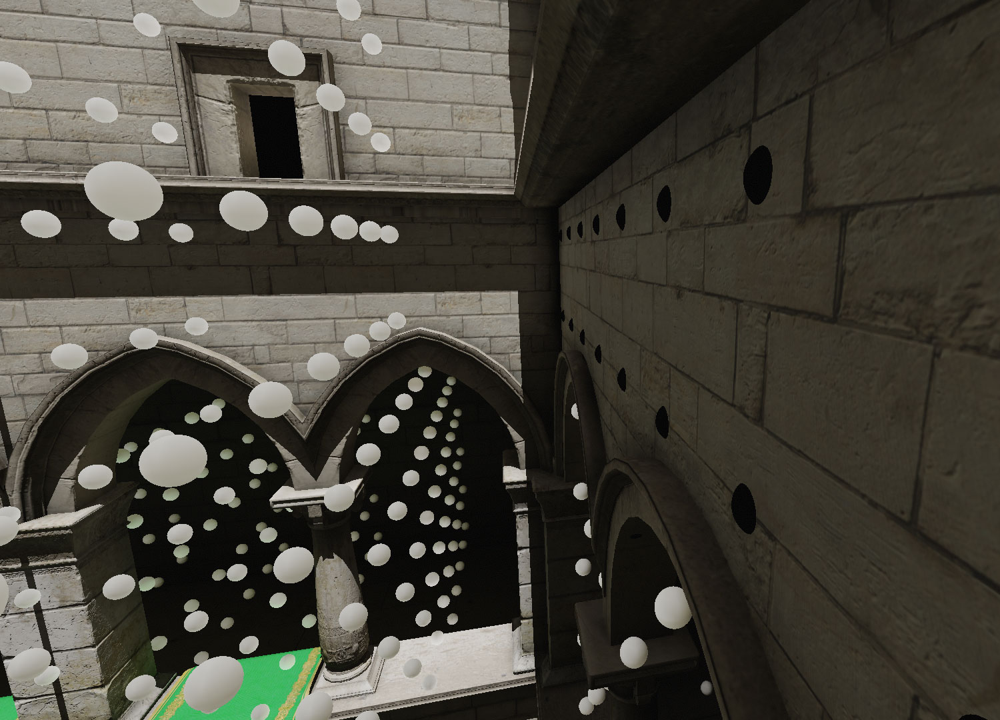</img>
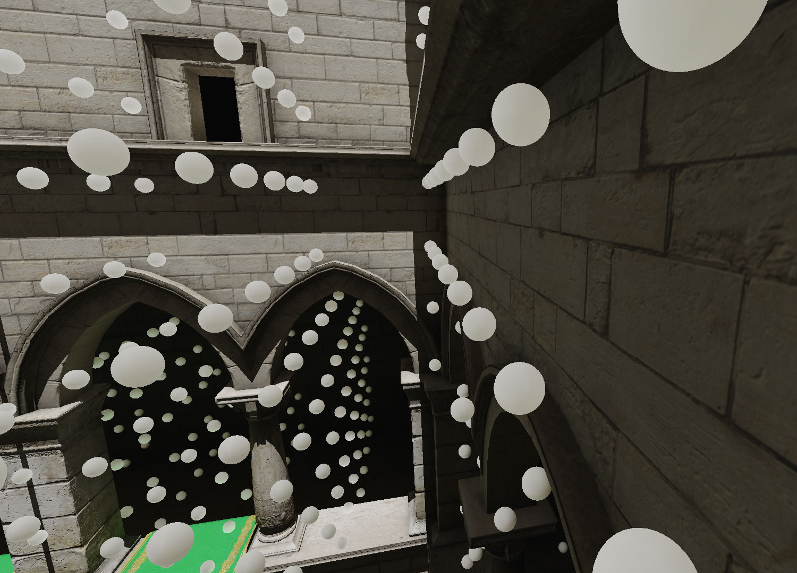</img>
<figcaption><b>Figure 11: (Left) Probes falling inside wall geometry without probe relocation. (Right) Probes adjusted to a more useful locations with probe relocation enabled.</b></figcaption>
</figure>

To use Probe Relocation:
  - Set ```DDGIVolumeDesc::probeRelocationEnabled``` to ```true``` during initialization or call ```DDGIVolume::SetProbeRelocationEnabled()``` at runtime.
  - Provide the compiled DXIL shader bytecode (or PSOs) for relocation during initialization.
    - See [Preparing Shaders](#preparing-shaders) for more information.
  - Call ```rtxgi::[d3d12|vulkan]::RelocateDDGIVolumeProbes(...)``` at render-time (at some frequency).

As shown in the above images, a common problem case occurs when probes land inside of geometry (e.g. walls). To move probes from the interior of geometry to a more useful location, probe relocation determines if the probe is inside of geometry and then adjusts its position. This is implemented by using a threshold value for backface probe rays hits. If enough of the probe's total rays are backfaces hits, then the probe is likely inside geometry. The ```DDGIVolumeDesc::probeBackfaceThreshold``` variable controls this ratio. When a probe is determined to be inside of geometry, the maximum adjustment to its position is 45% of the grid cell distance to prevent probes from being relocated outside of their grid voxel.

# Probe Classification

Probe classification aims to improve performance by identifying ```DDGIVolume``` probes that do not contribute to the final lighting result and disabling GPU work for these probes. For example, probes may be stuck inside geometry (even after relocation attempts to move them), exist in spaces without nearby geometry, or be far enough outside the play space that they are never relevant. In these cases, there is no need to spend time tracing and shading rays or updating the irradiance and distance texture atlases for these probes.

A per-probe state is computed on the GPU and maintained in the Probe Data texture. Each probe's *fixed rays* are used to determine if a probe is useful. See [Fixed Probe Rays for Relocation and Classsification](#fixed-probe-rays-for-relocation-and-classification) for more information. A probe's state can be retrieved using the ``DDGILoadProbeState()`` function. See [ProbeTraceRGS.hlsl](../samples/test-harness/shaders/ddgi/ProbeTraceRGS.hlsl) for an example and the [Shader API](ShaderAPI.md) for more information.

Classification is executed in two phases:
  - **Phase 1: Check if the probe is inside geometry**
    - Load the fixed ray distances and count the number of backface hits.
    - If the ratio of backface hits exceeds the threshold, mark the probe as inactive.
      - Classification is complete, Phase 2 is skipped.
  - **Phase 2: Check if the probe has nearby (front facing) geometry**
    - Iterate over the fixed rays (from Phase 1), get the ray direction, and find the intersection of the ray with the probe's relevant voxel planes.
    - Compare the distance stored for the ray with the intersection distance to the closest probe voxel plane.
    - If the ray distance is *less* than the plane intersection distance, mark the probe as active - there is geometry in the probe's voxel.
    - If no ray marks the probe as active, mark the probe as inactive.

<figure>
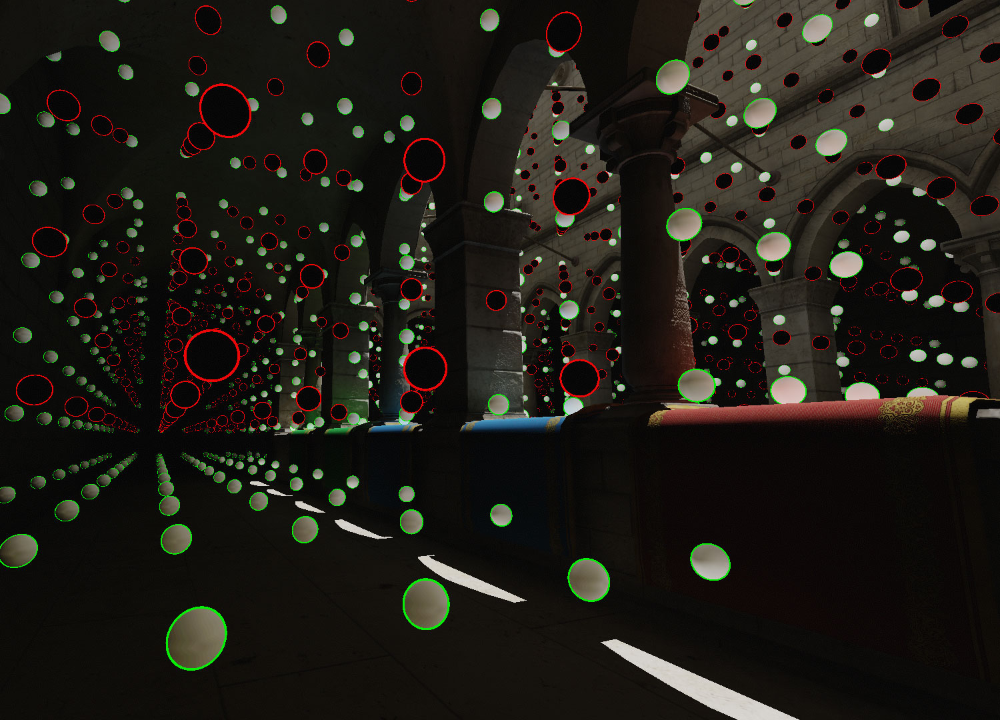</img>
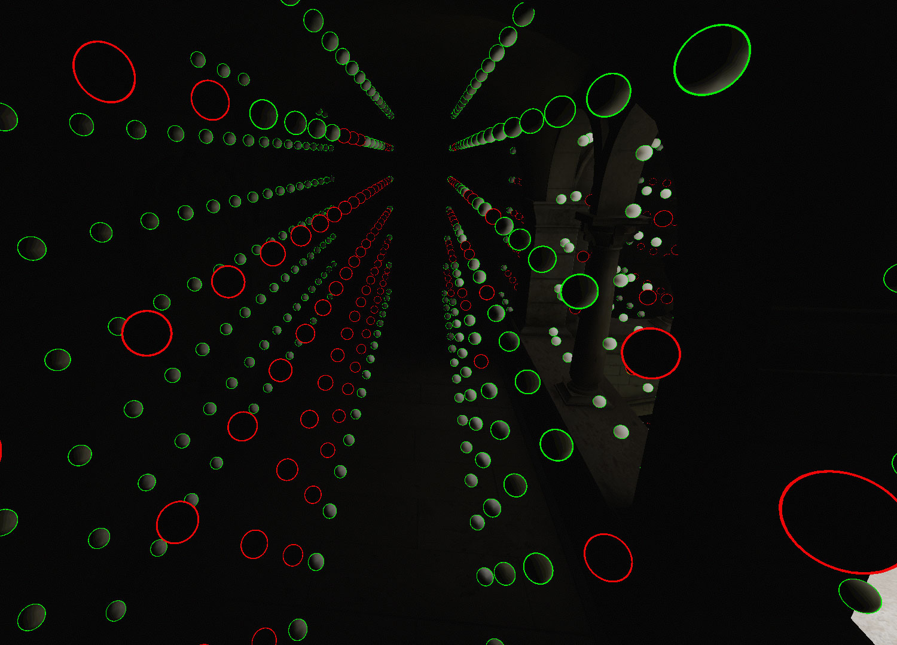</img>
<figcaption><b>Figure 12: Disabled probes are highlighted with red outlines. Probes inside of geometry or with no surrounding geometry are disabled.</b></figcaption>
</figure>


# Fixed Probe Rays for Relocation and Classification

Since probe relocation and classification can run continuously at arbitrary frequencies, temporal stability is essential to ensure probe irradiance and distance values remain accurate and reliable. To generate stable results, a subset of the rays traced for a probe are designated as *fixed rays*. Fixed rays have the *same* direction(s) every update cycle and are **not** randomly rotated. Fixed rays are *excluded* from probe blending since their regularity would bias the radiance and distance results. Consequently, lighting and shading can be skipped for fixed rays since these rays are never used for irradiance.

The number of fixed rays is specified by the ```RTXGI_DDGI_NUM_FIXED_RAYS``` define, which is 32 by default. Note that all probes trace *at least* ```RTXGI_DDGI_NUM_FIXED_RAYS``` rays every update cycle to have sufficient data for the relocation and classification processes. See [ProbeTraceRGS.hlsl](../samples/test-harness/shaders/ddgi/ProbeTraceRGS.hlsl) for an example.

 Fixed rays are distributed uniformly over the unit sphere using the same spherical fibonnaci method as the rest of the probe rays. A visualization of the default 32 fixed rays is below.

<figure>
</img>
<figcaption><b>Figure 13: The default fixed rays distribution used in probe relocation and classification.</b></figcaption>
</figure>

# Probe Variability

It is often the case that the irradiance estimates stored in ```DDGIVolume``` probes contain a non-zero level of variance (per octahedral texel), even after a substantial quantity of samples have been accumulated. In fact, it is possible that **some (or even all) texels of a given probe may never fully converge**. This results in a continuous amount of low frequency noise in indirect lighting estimates computed from a ```DDGIVolume```. While this is not a problem (visually) in a single frame (i.e. the estimate is still reasonable), the low frequency noise *changes randomly* each frame. This produces objectionable temporal artifacts.

To address this problem, ```DDGIVolume``` are now able to track probe variability. Probe Variability measures an average [coefficient of variation](https://en.wikipedia.org/wiki/Coefficient_of_variation) across the volume's probes. This serves as an estimate of how voliatile the volume's estimate of the light field is from one update to the next. As more samples are blended in and probe irradiance estimates improve, the measured variability will decrease towards zero. 

Importantly, the **variability value may not ever reach zero**. Instead, probe irradiance estimates eventually settle in a state where the variability stays within a given range. At this point, probes are converged 'enough' and the objectionable low frequency noise can be avoided by pausing probe ray tracing and blending updates for the ```DDGIVolume```. When an event that triggers a change to the volume's light field occurs (e.g. a light or object moves, an explosion occurs, weather changes, etc) ray tracing and blending updates should be re-enabled until the variability measure settles again.

The range and stability of probe variability values depends on several factors including: the extent of the ```DDGIVolume```, the distribution of probes, the number of rays traced per probe, and the light transport characteristics of the scene. As a result, the SDK exposes the measured variability and expects the application to make decisions to handle variability ranges and updates.

# Rules of Thumb

Below are rules of thumb related to ```DDGIVolume``` configuration and how a volume's settings affect the lighting results and content creation.

## Geometry Configuration

- To achieve proper occlusion results from DDGI, **avoid representing walls with zero thickness planes**.
  - Walls should have a "thickness" that is proportional to the probe density of the containing ```DDGIVolume```.
- If walls are too thin relative to the volume's probe density, you will observe **light leaking**.
- The planes that walls consist of should be **single-sided**.
  - The probe relocation and probe classification features track backfaces in order to make decisions.

## Probe Density and Counts

- High probe counts within a volume are usually not necessary (with properly configured wall geometry).
- **We recommend a probe every 2-3 meters for typical use cases.**
- Sparse probe grids can often produce better visual results than dense probe grids, since dense probes grids localize the effect of each probe and can (at times) reveal the structure of the probe grid.
- When in doubt, use the minimum number of probes necessary to get the desired result.

## View Bias

- If light leaking occurs - and zero thickness planes are not used for walls - the volume's ```probeViewBias``` value probably needs to be adjusted.
  - **Reminder:** ```probeViewBias``` is a world-space offset along the camera view ray applied to the shaded surface point to avoid numerical instabilities when determining visibility.
  - Increasing the ```probeViewBias``` value pushes the shaded point away from the surface and further into the probe's voxel, where the variance of the probe's mean distance values is lower.
  - Since ```probeViewBias``` is a world-space value, scene scale matters! As a result, **the SDK's default value likely won't be what your content requires**.


