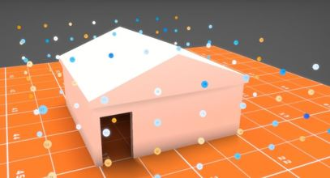
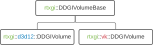
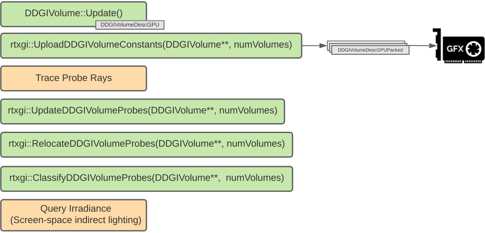

# RTXGI Integration Guide

Integrating the algorithms provided by the RTXGI SDK can be accomplished without substantial modifications to an existing renderer, provided the renderer already includes support for GPU ray tracing with a modern API (DirectX Raytracing and/or Vulkan Ray Tracing).

Due to the design of modern ray tracing APIs and the variability of material shaders from one application to another, the RTXGI SDK expects the application to own and maintain ray tracing acceleration structures, shader tables, and ray tracing pipeline state objects. It would be inappropriate for the SDK to own these structures, since this would impose unnecessary limitations on the application and reduce the generality of the SDKs implementations.

## Dynamic Diffuse Global Illumination (DDGI)

The implementation of the DDGI algorithm revolves around a defined volume of space that supports irradiance queries at arbitrary world-space locations. We refer to this space as a ```DDGIVolume```.  Shown below, each ```DDGIVolume``` contains a regular grid of probes that cache irradiance *and* distance information for use when gathering indirect light in screen-space.

</img>

### Integration Steps

An implementation of DDGI using the RTXGI SDK needs to perform the following steps:

At Load-Time

1. [Compile the SDK's DDGI shaders](DDGIVolume.md#volume-shaders) with the DirectX Shader Compiler (DXC)
2. [Describe the *properties*](DDGIVolume.md#creating-a-ddgivolume) of one or more ```DDGIVolume```
3. [Describe the *resources*](DDGIVolume.md#describing-resources) of one or more ```DDGIVolume```
4. [Create the DDGIVolume(s)](DDGIVolume.md#create)

At Render-Time

1. [**Update and Upload Constants**](DDGIVolume.md#updating-a-ddgivolume) for each relevant, active ```DDGIVolume```
    - *Tip:* you can manage this manually or with the SDK's ```UploadDDGIVolumeConstants()``` and ```UploadDDGIVolumeResourceIndices()``` functions
2. [**Trace Probe Rays**](#tracing-probe-rays-for-a-ddgivolume) for each relevant, active ```DDGIVolume```
    - *Tip:* get the ray dispatch dimensions using the SDK's ```GetRayDispatchDimensions()``` function
3. **Update Probes** using the ray traced probe data for each relevant, active ```DDGIVolume```
    - *Tip:* use the SDK's ```UpdateDDGIVolumeProbes()``` function
4. [**Relocate Probes (optional)**](DDGIVolume.md#probe-relocation) within relevant, active ```DDGIVolume```s to find optimal world-space probe positions for gathering radiance
    - *Tip:* use the SDK's ```RelocateDDGIVolumeProbes()``` function
5. [**Classify Probes (optional)**](DDGIVolume.md#probe-classification) within relevant, active ```DDGIVolume```s to deactivate tracing and blending operations for probes that do not contribute to the final result
    - *Tip:* use the SDK's ```ClassifyDDGIVolumeProbes()``` function
6. [**Calculate Variability (optional)**](DDGIVolume.md#probe-variability) within relevant, active ```DDGIVolume```s to generate variability measurements for the current update, then use these values to determine if the volume should remain active or not
    - *Tip:* use the SDK's ```CalculateDDGIVolumeVariability()``` and ```ReadbackDDGIVolumeVariability()``` functions
7. [**Query Irradiance**](#querying-irradiance-with-a-ddgivolume) from relevant, active ```DDGIVolume```s to gather indirect lighting in screen-space

### Implementation Details

The SDK provides host-side and shader-side code that implements most of the steps above. SDK host-side code provides a ```DDGIVolume``` class and ```rtxgi``` namespace functions that support both the DirectX Raytracing and Vulkan Ray Tracing APIs. API-agnostic ```DDGIVolume``` functionality is implemented in the abstract ```rtxgi::DDGIVolumeBase``` class and is provided by the [DDGIVolume.h](../rtxgi-sdk/include/rtxgi/ddgi/DDGIVolume.h) include file and the [DDGIVolume.cpp](../rtxgi-sdk/src/ddgi/DDGIVolume.cpp) source file.

API-specific code is organized in namespaces. D3D12 functionality is in the ```rtxgi::d3d12``` namespace and is provided by the [DDGIVolume_D3D12.h](../rtxgi-sdk/include/rtxgi/ddgi/gfx/DDGIVolume_D3D12.h) include file and the [DDGIVolume_D3D12.cpp](../rtxgi-sdk/src/ddgi/gfx/DDGIVolume_D3D12.cpp) source file. Similarly, Vulkan functionality is in the ```rtxgi::vk``` namespace and is provided by the [DDGIVolume_VK.h](../rtxgi-sdk/include/rtxgi/ddgi/gfx/DDGIVolume_VK.h) include file and the [DDGIVolume_VK.cpp](../rtxgi-sdk/src/ddgi/gfx/DDGIVolume_VK.cpp) source file.

</img>

**You only need to include the platform-specific ```DDGIVolume_[D3D12|VK].h``` header file to use the ```DDGIVolume```.**

See the [DDGIVolume Reference](DDGIVolume.md) for more information on creating and using the ```DDGIVolume```.

The integration steps described above are illustrated in the diagram below, where green bubbles indicate steps handled by the SDK and yellow bubbles indicate steps performed by the application. The API function calls show below are the Direct3D 12 version; however, the Vulkan equivalents of these calls are very similar.

</img>

### Tracing Probe Rays for a ```DDGIVolume```

The probe ray tracing step gathers radiance and distance data from the environment surrounding probes contained within a ```DDGIVolume```. The application is responsible for creating and maintaining the ray tracing acceleration structures and shader tables that specify the scene's geometry and materials.

Probe rays are dispatched by the application using ray generation shaders. A probe ray generation shader should execute the following steps:

  * Load the constants of a ```DDGIVolume```
  * Load the probe's state (if probe classification is enabled)
  * Compute the probe's world-space position
  * Compute the probe ray direction
  * Trace the ray
  * Handle ray miss and backface hits
  * Perform direct lighting for frontface hits
  * Sample irradiance from probes near the ray hit location (recursive irradiance)
  * Store the final radiance result in the Probe Ray Data texture

The SDK provides several shader functions to help with these steps. See the [Shader API](ShaderAPI.md) for more information. The Test Harness provides an example ray generation shader that demonstrates the above steps in [ProbeTraceRGS.hlsl](../samples/test-harness/shaders/ddgi/ProbeTraceRGS.hlsl).

***Important Note:*** *make sure the transform matrices of ray tracing geometry instances are packed in the proper row-major or column-major format. See [Descriptors.hlsl](../samples/test-harness/shaders/include/Descriptors.hlsl) in the Test Harness for an example.*


### Querying Irradiance with a ```DDGIVolume```

To query irriadiance and gather indirect light in screen-space using a ```DDGIVolume```, call the ```DDGIGetVolumeIrradiance(...)``` function in a fullscreen compute or pixel shader. This function computes irradiance at an arbitrary world-space point by using the ```DDGIVolume``` to gather and filter the irradiance stored in probes *while also* eliminating contributions from occluded probes based on the probe distance data.

Provide the following to ```DDGIGetVolumeIrradiance()```:

  - The world-space position of the surface point being shaded.
  - A small surface bias value, computed with the ```DDGIGetSurfaceBias(...)``` function.
  - The geometric normal direction of the surface (avoid using the shading normal).
  - The ```DDGIVolumeDescGPU``` constants.
  - The ```DDGIVolumeResources```, including the probe irradiance and distance atlas SRVs, probe data SRV, and a bilinear texture sampler.

Examples are provided in [IndirectCS.hlsl](../samples/test-harness/shaders/IndirectCS.hlsl) and [ProbeTraceRGS.hlsl](../samples/test-harness/shaders/ddgi/ProbeTraceRGS.hlsl). See the [Shader API](ShaderAPI.md) for more information.

### Volume Blending

The SDK provides the ```DDGIGetVolumeBlendWeight(...)``` shader function to aid in blending between multiple volumes and/or regions not covered by a ```DDGIVolume```. This use case may arise when a scene has multiple overlapping volumes or if there is a region of the scene that needs indirect lighting and others that strictly do not (for example, due to artistic or performance reasons).

```DDGIGetVolumeBlendWeight()``` computes a weight value in the range [0, 1] for a world position and volume pair. All positions *inside* the given volume recieve a weight of 1 (full contribution) and positions *outside* the volume receive a weight in [0, 1] that decreases as the position moves further away from the volume. Below is an example of how to use this function when blending between a volume and non-volume region.

```C++
// A hard coded ambient term (black) may be passed in
float3 ambient = 0.f;

// Get the volume blend weight (0-1)
float blendWeight = DDGIGetVolumeBlendWeight( worldPosHitT.xyz, DDGIVolume);

// Only get irradiance if it is necessary
if (blendWeight > 0.f)
{
    // Get irradiance from the DDGIVolume
    irradiance = DDGIGetVolumeIrradiance(
        worldPosHitT.xyz,
        surfaceBias,
        normal,
        DDGIVolume,
        resources);
}

// Blend between irradiance and the constant ambient term
irradiance = blendWeight * irradiance + (1.f - blendWeight) * ambient;
```

When blending between multiple volumes, blending only needs to occur at the edges of the volumes. When volumes overlap, sort and select the appropriate volume to use in shading based on heuristics such as probe density, proximity to the surface, the volume's screen coverage, and/or an artist driven priority value. An example of this functionality is available in the [RTXGI UE4 Plugin](../ue4-plugin/4.27/RTXGI/README.md).


### Integration Examples

The Test Harness sample application provides examples of a full DDGI integration for the D3D12 and Vulkan APIs.

#### Load-Time

- DDGI Shader Compilation: see ```CompileDDGIVolumeShaders()``` in [DDGI.cpp](../samples/test-harness/src/graphics/DDGI.cpp#L99).

- API-specific initialization and start-up: see ```Initialize()``` in [DDGI_D3D.cpp](../samples/test-harness/src/graphics/DDGI_D3D12.cpp#L924) and/or [DDGI_VK.cpp](../samples/test-harness/src/graphics/DDGI_VK.cpp#L1330).

#### Render-Time

- Update/Upload Constants: see ```Update()``` and ```Execute()``` in [DDGI_D3D12.cpp](../samples/test-harness/src/graphics/DDGI_D3D12.cpp#L999) and [DDGI_VK.cpp](../samples/test-harness/src/graphics/DDGI_VK.cpp#L1425).

- Trace Probe Rays: see ```RayTraceVolumes()``` in [DDGI_D3D12.cpp](../samples/test-harness/src/graphics/DDGI_D3D12.cpp#L847) and [DDGI_VK.cpp](../samples/test-harness/src/graphics/DDGI_VK.cpp#L1252).

- Update/Relocate/Classify Probes: see ```Execute()``` in [DDGI_D3D12.cpp](../samples/test-harness/src/graphics/DDGI_D3D12.cpp#L1032) and [DDGI_VK.cpp](../samples/test-harness/src/graphics/DDGI_VK.cpp#L1458).

- Query Irradiance: see ```GatherIndirectLighting()``` in [DDGI_D3D12.cpp](../samples/test-harness/src/graphics/DDGI_D3D12.cpp#L948) and [DDGI_VK.cpp](../samples/test-harness/src/graphics/DDGI_VK.cpp#L1314) and [IndirectCS.hlsl](../samples/test-harness/shaders/IndirectCS.hlsl).
