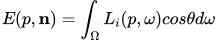
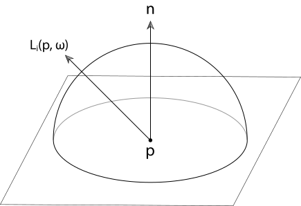
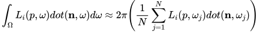
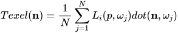
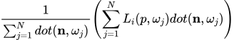
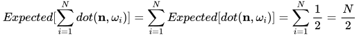
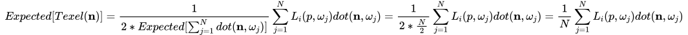

# RTXGI Math Guide

## Irradiance

To find the illumination of a point on a surface in space, we compute the **irradiance** () at the point. <a href="http://www.pbr-book.org/3ed-2018/Color_and_Radiometry/Radiometry.html#x1-Radiance" target="_blank">Radiometry</a> defines irradiance as the flux of radiant energy per unit area _arriving_ at a surface. The complement of irradiance is **radiant exitance** (), the flux of radiant energy per unit area _leaving_ a surface. Irradiance and radiant exitance; however, do not capture the directional distribution of energy. **Radiance** (), the flux of radiant energy per unit projected area, per unit solid angle (e.g. along a single ray), provides the directional information needed to compute irradiance and radiant exitance.

To compute irradiance, we evaluate the **incoming radiance** () over the set of all directions () in the hemisphere above the surface point. Mathematically, this is expressed by the integral of cosine-radiance over the hemisphere.

For a point  with normal , irradiance  is written as:
<figure>
</img>
<figcaption ><b>Equation 1: Irradiance</b></figcaption>
</figure>

where:
  *  is the equation for incoming radiance at point  from direction .
  *  is the angle between the incoming radiance direction  and the surface normal .

Since the dot product represents the cosine of the angle between two vectors, Equation 1 can also be written as:
<figure>
</img>
<figcaption ><b>Equation 2: Irradiance reformulated with a dot product</b></figcaption>
</figure>

Note that the  and  terms do not need to be clamped since we restrict the set of directions  to the hemisphere above the surface. This is illustrated in the figure below from <a href="http://www.pbr-book.org/3ed-2018/Color_and_Radiometry/Working_with_Radiometric_Integrals.html" target="_blank">Physically Based Rendering, 3rd Edition:</a>
<figure>
</img>
<figcaption style="text-align:left; width:600px"><b>Figure 1: Irradiance at a point <i>p</i> is given by the integral of incoming radiance times the cosine of the incident direction over the entire upper hemisphere above the point.</b></figcaption>
</figure>

## Dynamic Diffuse Global Illumination (DDGI)

### Irradiance Integral Estimator

As is the case with all renderers, DDGI approximates  since it can't be evaluated directly. We approximate the irradiance integral using a <a href="http://www.pbr-book.org/3ed-2018/Monte_Carlo_Integration/The_Monte_Carlo_Estimator.html" target="_blank">Monte Carlo Estimator</a> and a uniformly distributed set of sample directions.

The estimator transforms Equation 2 into:
<figure>
</img>
<figcaption style="text-align:left; width:600px"><b>Equation 3</b></figcaption>
</figure>

where  is the number of **incoming radiance** directions (or samples). The summation represents the average value of the incoming radiance over the unit hemisphere multiplied by a constant term representing the integration domain (i.e. the area of the unit hemisphere). The approximate equality sign is used here to denote that the expected value of the quantity on the right is equal to the integral on the left, even though each individual average of  samples will have some variance.

### Probe Storage and Lookup

In our implementation of DDGI, each probe irradiance texel stores the Monte Carlo Estimator defined in Equation 4 for a point  and direction  defined by an octahedral parameterization of a sphere:

<figure>
</img>
<figcaption style="text-align:left; width:600px"><b>Equation 4</b></figcaption>
</figure>

To decrease variance in the estimate stored in the probes, we divide the sum of incoming radiance _by the sum of the cosine weights_ (instead of the number of radiance samples). This gives the quantity:
<figure>
</img>
<figcaption style="text-align:left; width:600px"><b>Equation 5</b></figcaption>
</figure>

But, we don't write this quantity exactly to the probe texels. To see why, consider that the  term is a sum of  cosine values uniformly distributed on the hemisphere. The expected value of this quantity is:

<figure>
</img>
<figcaption style="text-align:left; width:600px"><b>Equation 6</b></figcaption>
</figure>

Recalling Equation 4, we get an average by dividing by . If we were to divide by  above, the result would be off by a factor of 2. Therefore, we multiply the sum of the cosine weights by 2 before dividing by it to obtain the correct average. This final value is written to the probe texel:

<figure>
</img>
</figure>

To estimate the irradiance integral, this quantity is read from probes and then multiplied by .

See `DDGIGetVolumeIrradiance()` in [Irradiance.hlsl](../rtxgi-sdk/shaders/ddgi/Irradiance.hlsl):

```c++
irradiance *= (2.f * RTXGI_PI); // Factored out of the probes
```

This yields the final estimate of the irradiance integral as described in Equation 3.
